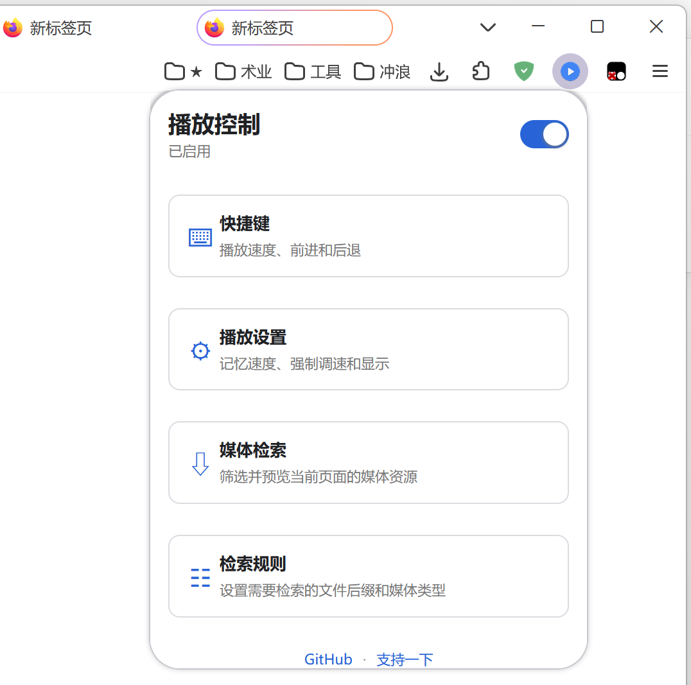
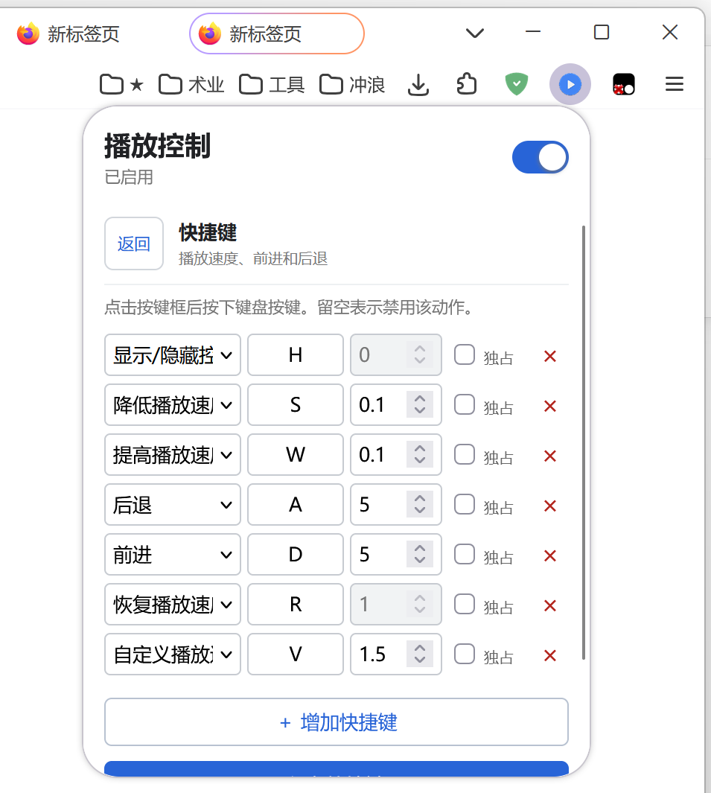

# 播放控制

[简体中文](README.md) | [English](README_en.md)

项目仓库：<https://github.com/Shelus2021/PlaybackController>

面向 Firefox 的本地扩展，用于控制网页视频和音频的播放速度、快速前进/后退，并检索当前页面加载的媒体资源。

## 预览

<table>
  <tr>
    <td width="25%"></td>
    <td width="25%"></td>
    <td width="25%"></td>
    <td width="25%"></td>
  </tr>
</table>

## 功能

- 页面内播放控制器，可拖动并自动适应视频边缘。
- 快捷键控制显示、速度、前进、后退和自定义速度。
- 按网站记忆扩展启用状态。
- 媒体资源检索、筛选、排序、预览和下载；展开资源即可查看、复制或打开原始链接。
- 展开媒体项会直接显示文件格式、大小或可选画质，确认方案后才创建下载任务。
- M3U8/HLS 内嵌预览。
- 常见点播 M3U8 会先展示一个或多个下载方案，标明分辨率、预计大小和音轨状态，确认后才开始下载；支持无损合并独立 AAC 音轨。
- 下载完成前会重建连续的 MP4 时间轴，避免长视频因分片时间戳跳变而出现时长错误或卡屏。
- 可配置检索后缀、Content-Type 和最小文件大小。
- 根据 Firefox 界面语言自动切换简体中文或英文。
- Firefox 授予隐私窗口访问权限后可在隐私窗口中使用；隐私媒体记录仅保存在内存中。

## 默认快捷键

- `H`：显示或隐藏控制器
- `S`：降低播放速度
- `W`：提高播放速度
- `A`：后退 5 秒
- `D`：前进 5 秒
- `R`：恢复 1.0 倍速
- `V`：切换到 1.5 倍自定义速度

所有设置均可直接在扩展弹窗中修改。

## 安装

在 Firefox 中通过“从文件安装附加组件”选择打包后的 `.xpi` 文件；开发调试时也可以在 `about:debugging` 中临时载入本目录的 `manifest.json`。

## 隐私

扩展不包含分析、广告或开发者自有的数据上传服务。媒体检索结果会在浏览器本地暂存，包含媒体地址、来源页地址和页面标题，并会在页面导航、标签页关闭或定期清理时移除。是否允许扩展在隐私窗口运行完全由 Firefox 的扩展权限控制；获准后，隐私窗口中的媒体记录仅保存在内存中，不会写入 `storage.local`。

预览或下载媒体时，扩展会直接连接对应媒体服务器，并可能携带该网站已有的登录凭据以及必要的 Referer/Origin 请求头。普通设置保存在 `storage.sync`，是否由 Firefox Sync 同步取决于用户的浏览器账户设置。完整说明见 [`PRIVACY.md`](PRIVACY.md)。

## 来源与许可

播放控制部分基于 Ilya Grigorik 的 Video Speed Controller 项目及 codebicycle 的 Firefox 移植版修改，对应上游代码采用 MIT License。

媒体检索功能基于猫抓 1.x 代码线修改，该代码线采用 MIT License；猫抓 2.x 及之后的代码改用 GPL-3.0，本项目不因此自动适用 GPL-3.0，但也不应在未遵守 GPL-3.0 的情况下引入其 2.x 代码。

HLS 预览使用 hls.js 1.4.4（Apache-2.0），MPEG-TS 到 MP4 的轻量转封装使用 mux.js（Apache-2.0），独立音视频轨道的 MP4 容器合并使用 MP4Box.js（BSD-3-Clause）。

完整的第三方来源、文件范围和许可文本索引见 [`THIRD_PARTY_NOTICES.md`](THIRD_PARTY_NOTICES.md)。第三方许可仅适用于其覆盖的代码，不会自动放弃或转移独立新增代码的著作权。分发或再发布时请将这些许可与声明一并保留。

本项目由 GitHub 用户 [Shelus2021](https://github.com/Shelus2021) 维护。除明确标注的第三方内容外，独立新增内容采用“保留全部权利”的源码可见方式发布，并非开源许可证授权。公开仓库允许依照 GitHub 平台功能查看和 fork，但不额外授予复制、修改、分发、再许可或销售独立新增内容的权利。具体边界、第三方许可例外和免责声明见 [`LICENSE`](LICENSE)。
